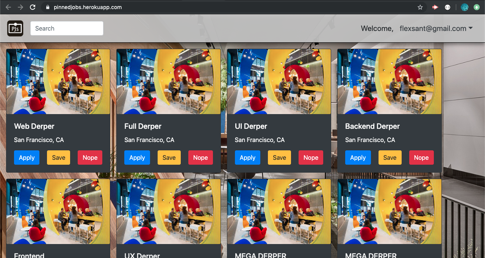
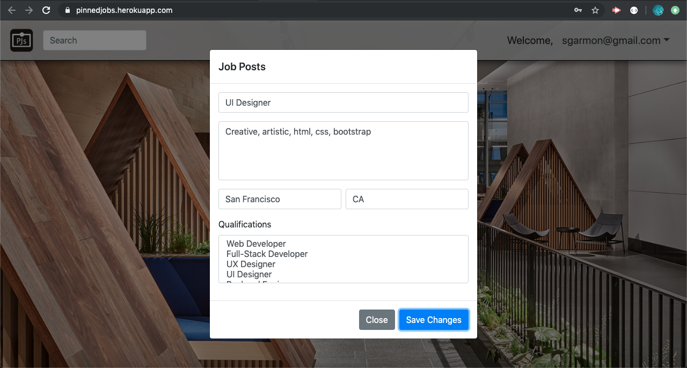

# Pinned Jobs
[Site](https://pinnedjobs.herokuapp.com/)
## Summary
Searching for a job can be daunting and often unorganized…
PinnedJobs allows our users to easily search for tech jobs within their area as well as the ability to pin and keep track of all the jobs applied to. 
Employers have the ability to post career opportunities making it easier to find the perfect match and fill job vacancies. 

## Visual Aids




## User Guides
- PinnedJobs allows the user to easily log-in as an employee or employer. 
- As an employee once you have created a profile you can pin all of your prospective careers. The employee user can also apply, save, or nope(delete) job. 
- As an employer you can post jobs and view profiles of users who match your postins needs. 

## Code Snippet
```Javascript
// hashing password /encrypting
     app.put("/api/user/", function (req, res) {
        var pw = req.body.password;
        db.users.findAll({
            where: {
                email: req.body.email
            }
        }).then(function(data) {
            if (pw) {
                var hash = data[0].dataValues.password;
                bcrypt.compare(pw, hash, function(err, conf) {
                    if (err) throw err;

                    if (conf) {
                        res.json(data)
                    } else {
                        res.send(conf)
                    }
                })
            } else {
                res.json(data);
            }
        }).catch(function(err) {
            console.log(err)
        })
    })
```
>Used BCrypt library to hash password

```Javascript
// Get employee profile based on city name
    app.get("/api/new/profile/:cityName", function (req, res) {
        var cityName = req.params.cityName;

        db.Profile.findAll({
            where: {
                city: cityName
            }
        }).then(function (result) {
            console.log(result);
            res.json(result);
        });
    })
```
> This is basically a search query to search a particular profile based on a city name

```Javascript
// Associating jobs with many statuses
    Job.associate = function(models) {
        models.Job.hasMany(models.Status, { foreignkey: "jobId", sourceKey: "id" });
    };
    
    return Job;
}
```
> Job model has many relationships with Status table for application to keep track of all Applied/Saved jobs
```Javascript
// Creating new employer with Ajax method POST
       $.ajax("/api/new/employer", {
            type: "POST",
            data: newEmployer
        }).then(function (result) {
            console.log(result);
            console.log("New employer created");
            // To reload the page
            // location.reload();
            displayAllPosts();
            $("#j-post").modal("toggle");

        })
```
> Code snippet to create new employer when he/she is logged in
```Javascript
    // All accepted candidates
    app.get("/api/all/accepted/:employerId", function (req, res) {
        db.Profile.findAll({
            include: [{
                model: db.Status,
                attributes: ['jobId', 'accepted'],
                where: {
                    jobId: req.params.employerId,
                    accepted: 1
                }
            }],

        }).then(function (result) {
            res.json(result);
        }).catch(function (err) {
            console.log(err);
        })
    });
}
```
> Used left join sequelize query to join Profile and status model so that each employer can keep track of all accepted profiles

## Technologies Used
- Git - version control system to track changes to source code.
- GitHub - hosts repository that can be deployed to GitHub Pages.
- Javascript - allows dynamic interaction between user and computer data entry.
- JQuery - a javascript library that allows for simple yet more diverse and less verbos.
- NODE.js - javascript run-time environment that can be run outside of browser.
- Inquirer - command line user interfaces.
- Sequelize - Capture all the data and store into a table.
- Express - A node package for server hosting.
- MVC - Model, Views, Controller
- Node.js - Backend server.
- BCrypt - Used for hashing and comparing passwords.
- jQuery - A library used for server communication.
- Bootstrap - Used to help create our UI.
- HTML - Backbone of the site.
- CSS - For additional styling.


## Learning Points 
- Introducing a new library BCrypt which was used for hashing and comparing passwords
- Utilizing comments with our code to help during merging of back and front ends
- Using a personal server to store our data instead of relying on a third party 
## Collaborators
- Mahisha Gunasekaran - [GitHub](https://github.com/Mahi-Mani) | [LinkedIn](https://www.linkedin.com/in/mahisha-gunasekaran-0a780a88/)
- Lex Santos - [GitHub](https://github.com/flexsant) | [LinkedIn](https://www.linkedin.com/in/lex-santos-673623194/)
- Ron Melendres - [GitHub](https://github.com/RonMelendres) | [LinkedIn](https://www.linkedin.com/in/ron-melendres-88a719191/)
- Kerwin Hy - [GitHub](https://github.com/seiretsym) | [LinkedIn](https://www.linkedin.com/in/kerwinhy/)
